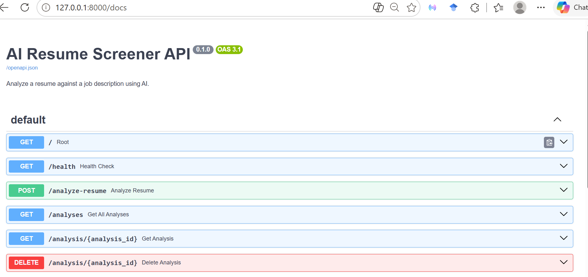
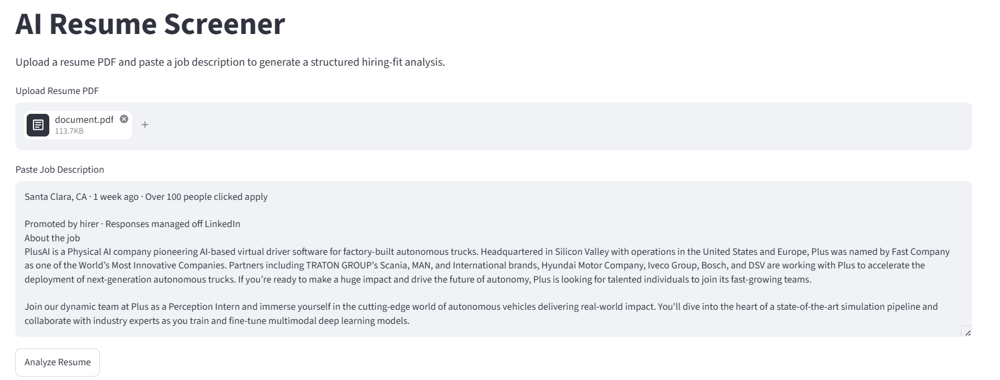
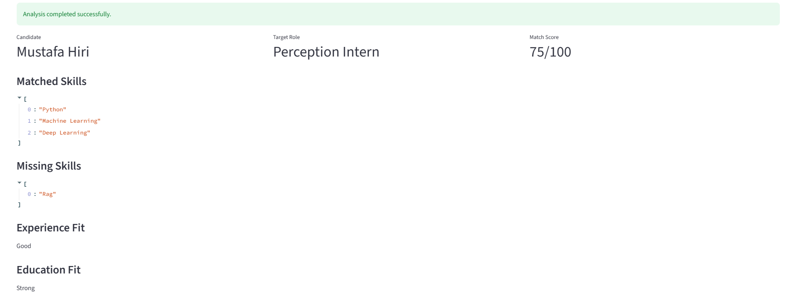
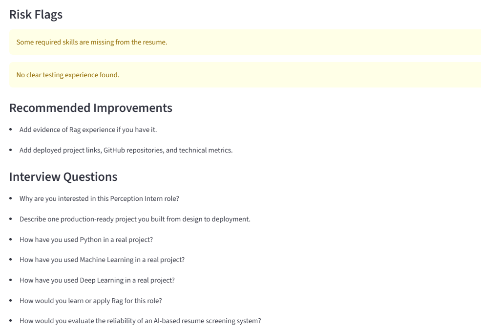

# AI Resume Screener API

An AI-powered backend API and Streamlit demo app that compares a candidate resume against a job description and returns a structured hiring-fit analysis.

This project is built as a production-style AI Engineering portfolio project. It includes FastAPI, PDF parsing, OpenAI structured analysis, rule-based fallback scoring, SQLite storage, API tests, Docker support, a simple Streamlit frontend, and structured JSON responses.

## Problem

Recruiters and hiring teams often review many resumes manually. This process can be slow, inconsistent, and difficult to standardize across many candidates.

## Solution

This API accepts a resume PDF and a job description, extracts resume text, analyzes the candidate profile against the job requirements, calculates a match score, identifies missing skills, generates risk flags, recommends improvements, creates interview questions, and stores the analysis in a local SQLite database.

The project supports two analysis modes:

- **AI mode**: uses OpenAI Structured Outputs to generate a structured hiring-fit analysis.
- **Fallback mode**: uses deterministic rule-based parsing and scoring if OpenAI is unavailable, disabled, or the API key is invalid.

The API response includes an `analysis_mode` field so users can see whether the result was generated by OpenAI or by the fallback system.

## Features

- Upload resume as PDF
- Submit job description text
- Extract resume text using PyMuPDF
- Analyze resume with OpenAI Structured Outputs
- Rule-based fallback when OpenAI is unavailable
- Extract required skills from job descriptions
- Match resume skills against job requirements
- Calculate match score from 0 to 100
- Detect candidate name
- Detect target role
- Generate experience fit and education fit
- Generate missing skills and risk flags
- Generate recommended improvements
- Generate interview questions
- Save analyses in SQLite
- Retrieve saved analyses
- Delete saved analyses
- Display analysis mode: `openai` or `rule_based_fallback`
- Streamlit frontend for demo usage
- Unit tests and API tests
- Docker support

## Tech Stack

| Layer | Tool |
|---|---|
| Language | Python |
| API Framework | FastAPI |
| Frontend | Streamlit |
| AI Integration | OpenAI API |
| Validation | Pydantic |
| PDF Parsing | PyMuPDF |
| Database | SQLite |
| ORM | SQLAlchemy |
| Testing | pytest |
| API Testing | FastAPI TestClient |
| Containerization | Docker |

## Project Architecture

```text
Resume PDF
    ↓
PDF Text Extraction
    ↓
Job Description Parsing
    ↓
Rule-Based Baseline Scoring
    ↓
OpenAI Structured Analysis
    ↓
Fallback Logic if OpenAI Fails
    ↓
Analysis Mode Detection
    ↓
SQLite Storage
    ↓
Structured JSON API Response
    ↓
Streamlit Frontend Display
```

## Folder Structure

```text
ai-resume-screener-api/
│
├── app/
│   ├── __init__.py
│   ├── main.py
│   ├── schemas.py
│   ├── config.py
│   ├── services/
│   │   ├── __init__.py
│   │   ├── resume_parser.py
│   │   ├── jd_parser.py
│   │   ├── scoring.py
│   │   ├── profile_extractor.py
│   │   ├── report_generator.py
│   │   └── ai_analyzer.py
│   └── database/
│       ├── __init__.py
│       ├── db.py
│       └── models.py
│
├── frontend/
│   └── streamlit_app.py
│
├── tests/
│   ├── test_api.py
│   ├── test_scoring.py
│   ├── test_jd_parser.py
│   └── test_profile_extractor.py
│
├── screenshots/
│   ├── swagger-docs.png
│   ├── health-endpoint.png
│   ├── analyze-resume-response.png
│   ├── saved-analyses.png
│   ├── frontend-upload.png
│   └── frontend-result.png
│
├── requirements.txt
├── Dockerfile
├── docker-compose.yml
├── pytest.ini
├── .env.example
├── .gitignore
├── .dockerignore
└── README.md
```

## Main Files

| File | Purpose |
|---|---|
| `app/main.py` | Main FastAPI application and API endpoints |
| `app/schemas.py` | Pydantic models for structured API responses |
| `app/config.py` | Loads environment variables such as OpenAI API key and model |
| `app/services/resume_parser.py` | Extracts text from uploaded PDF resumes |
| `app/services/jd_parser.py` | Extracts required skills from job descriptions |
| `app/services/scoring.py` | Matches resume skills with job requirements and calculates score |
| `app/services/profile_extractor.py` | Extracts candidate name and target role using fallback rules |
| `app/services/report_generator.py` | Generates fallback analysis report fields |
| `app/services/ai_analyzer.py` | Uses OpenAI API for structured resume analysis |
| `app/database/db.py` | Configures SQLite database connection |
| `app/database/models.py` | Defines SQLAlchemy database model |
| `frontend/streamlit_app.py` | Streamlit frontend for uploading resumes and viewing results |
| `tests/` | Contains automated unit and API tests |
| `Dockerfile` | Defines the Docker image build process |
| `docker-compose.yml` | Runs the app using Docker Compose |
| `.env.example` | Shows required environment variables without exposing secrets |
| `.gitignore` | Prevents private or unnecessary files from being pushed to GitHub |
| `.dockerignore` | Prevents unnecessary files from being copied into the Docker image |

## API Endpoints

| Method | Endpoint | Description |
|---|---|---|
| GET | `/` | Root endpoint |
| GET | `/health` | API health check |
| POST | `/analyze-resume` | Analyze resume against job description |
| GET | `/analyses` | Retrieve all saved analyses |
| GET | `/analysis/{analysis_id}` | Retrieve one saved analysis |
| DELETE | `/analysis/{analysis_id}` | Delete one saved analysis |

## Example Response

```json
{
  "id": 1,
  "candidate_name": "John Doe",
  "target_role": "Deep Learning Intern",
  "match_score": 78,
  "matched_skills": [
    "Python",
    "Machine Learning",
    "Deep Learning",
    "Computer Vision"
  ],
  "missing_skills": [
    "3D Vision",
    "Motion Tracking",
    "Semantic Segmentation"
  ],
  "experience_fit": "Good",
  "education_fit": "Strong",
  "risk_flags": [
    "Some required skills are missing from the resume.",
    "No clear production deployment experience found."
  ],
  "recommended_improvements": [
    "Add evidence of 3D Vision experience if you have it.",
    "Add evidence of Motion Tracking experience if you have it.",
    "Add deployed project links, GitHub repositories, and technical metrics."
  ],
  "interview_questions": [
    "Why are you interested in this Deep Learning Intern role?",
    "Describe one deep learning project you built from design to evaluation.",
    "How have you used Python in a real project?",
    "How would you approach object detection for autonomous vehicle perception?"
  ],
  "extracted_resume_preview": "John Doe has experience with Python, machine learning...",
  "analysis_mode": "rule_based_fallback"
}
```

## Analysis Modes

The response includes:

```json
"analysis_mode": "openai"
```

or:

```json
"analysis_mode": "rule_based_fallback"
```

Meaning:

| Mode | Description |
|---|---|
| `openai` | The analysis was generated using the OpenAI API |
| `rule_based_fallback` | The OpenAI call failed or was disabled, so the local fallback system generated the result |

This makes the project transparent and easier to debug.

## Environment Variables

Create a `.env` file in the project root.

```text
OPENAI_API_KEY=your_openai_api_key_here
OPENAI_MODEL=gpt-4.1-nano
```

Use `.env.example` as a template.

Do not commit your real `.env` file to GitHub.

## Run Locally

Clone the repository:

```bash
git clone https://github.com/username/ai-resume-screener-api.git
cd ai-resume-screener-api
```

Create a virtual environment:

```bash
python -m venv .venv
```

Activate it on Windows:

```cmd
.venv\Scripts\activate
```

Install dependencies:

```bash
python -m pip install -r requirements.txt
```

Run the API:

```bash
python -m uvicorn app.main:app --reload
```

Open Swagger UI:

```text
http://127.0.0.1:8000/docs
```

## Run the Frontend

Run the backend first:

```bash
python -m uvicorn app.main:app --reload
```

Open a second terminal and run the Streamlit frontend:

```bash
python -m streamlit run frontend/streamlit_app.py
```

Open:

```text
http://localhost:8501
```

The frontend allows users to:

- Upload a resume PDF
- Paste a job description
- Submit the analysis request
- View candidate name, target role, match score, matched skills, missing skills, risk flags, recommendations, interview questions, and raw JSON output

## Run Without OpenAI

To force rule-based fallback mode during testing or development:

```cmd
set DISABLE_OPENAI=true
python -m uvicorn app.main:app --reload
```

To enable OpenAI again:

```cmd
set DISABLE_OPENAI=
python -m uvicorn app.main:app --reload
```

## Run Tests

Run all tests:

```bash
python -m pytest
```

To avoid calling OpenAI during tests:

```cmd
set DISABLE_OPENAI=true
python -m pytest
```

## Run with Docker

Build the Docker image:

```bash
docker build -t ai-resume-screener-api .
```

Run the container:

```bash
docker run -p 8000:8000 ai-resume-screener-api
```

Open:

```text
http://127.0.0.1:8000/docs
```

Using Docker Compose:

```bash
docker compose up --build
```

## Database

The project uses SQLite.

After running an analysis, this local database file is created:

```text
resume_screener.db
```

The database stores saved analyses in the `resume_analyses` table.

The database file is ignored by Git because it may contain private resume data.

## Security Notes

Do not commit these files or folders to GitHub:

```text
.env
resume_screener.db
uploads/
.venv/
venv/
__pycache__/
```

The `.gitignore` file should include:

```gitignore
.env
*.db
.venv/
venv/
__pycache__/
uploads/
```

The `.dockerignore` file should include:

```gitignore
__pycache__/
*.pyc
.env
.venv/
venv/
.git/
.pytest_cache/
*.db
uploads/
screenshots/
```

Never expose the OpenAI API key in:

- GitHub
- screenshots
- frontend code
- README examples
- public logs

The frontend should call the FastAPI backend. It should not call OpenAI directly.

## Current Limitations

- Resume parsing works best with text-based PDFs.
- Scanned resumes are not supported yet.
- Skill extraction fallback is rule-based.
- OpenAI mode requires a valid OpenAI API key and active API billing.
- No authentication yet.
- SQLite is used for local development only.
- Streamlit frontend is for demonstration, not production deployment.
- The project does not yet rank multiple candidates against one job description.

## Future Improvements

- Add OCR for scanned resumes
- Add PostgreSQL support
- Add authentication
- Add frontend dashboard with better UI
- Add deployment to Render, Railway, Fly.io, or AWS
- Add CI/CD with GitHub Actions
- Add LLM evaluation metrics
- Add duplicate analysis detection to reduce API cost
- Add candidate ranking across multiple resumes
- Add admin dashboard for saved analyses
- Add export to CSV or PDF
- Add resume redaction for privacy protection

## Screenshots

Add screenshots after testing the API and frontend locally.

Recommended screenshots:

```text
screenshots/swagger-docs.png
screenshots/health-endpoint.png
screenshots/analyze-resume-response.png
screenshots/saved-analyses.png
screenshots/frontend-upload.png
screenshots/frontend-result.png
```

Example Markdown:

```markdown




```

## Project Status

In development.

Completed components:

- FastAPI backend
- PDF resume upload
- PDF text extraction
- Rule-based skill matching
- OpenAI structured analysis integration
- Rule-based fallback mode
- Analysis mode indicator
- SQLite database storage
- Saved analysis retrieval
- Saved analysis deletion
- Unit tests
- API tests
- Docker support
- Streamlit frontend demo

Remaining before strong portfolio release:

- Verify OpenAI mode with a valid active API key
- Add screenshots
- Push to GitHub
- Add deployment instructions
- Add live deployment link if deployed